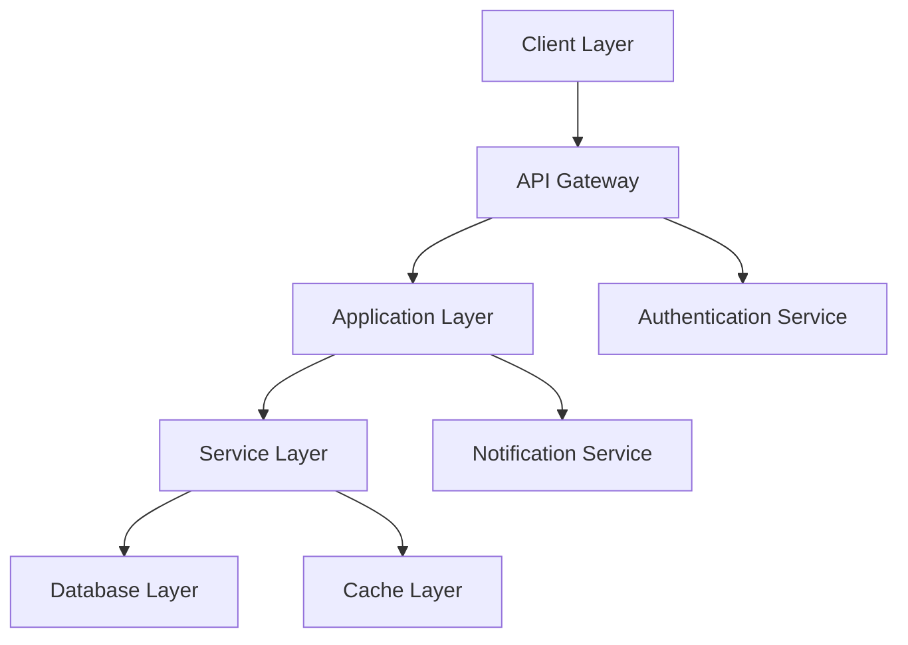

# 🚀 E-OD: Events and OD Management Platform

## 📋 Table of Contents
- [Overview](#overview)
- [Core Features](#core-features)
- [Architecture](#architecture)
- [Technical Stack](#technical-stack)
- [Getting Started](#getting-started)
- [Project Structure](#project-structure)
- [API Documentation](#api-documentation)
- [Security](#security)
- [User Roles & Permissions](#user-roles--permissions)
- [Contributing](#contributing)
- [Support](#support)

## Overview

The E-OD System is a modern, scalable platform designed to digitize and streamline On-Duty (OD) management and event organization in educational institutions. It replaces traditional paper-based workflows with an efficient digital solution that maintains institutional hierarchies while providing real-time updates and transparent tracking.

### Key Benefits
- Reduced processing time for OD approvals
- Paperless, environment-friendly workflow
- Real-time tracking and notifications
- Comprehensive event management
- Data-driven insights for administration
- Enhanced transparency and accountability

## Core Features

### Student Portal
- **Smart OD Request System**
  - Intuitive form with auto-fill capabilities
  - Document upload support (medical certificates, event invitations)
  - Multi-level approval tracking
  - Emergency request prioritization

- **Event Management**
  - One-click event registration
  - Participation certificate generation
  - Event calendar integration
  - Automated attendance marking

- **Dashboard Analytics**
  - OD usage statistics
  - Event participation history
  - Course-wise attendance reports
  - Notification center

### Faculty Dashboard
- **OD Management Console**
  - Batch approval capabilities
  - Custom approval workflows
  - Student history view
  - Communication channel with students

- **Course Management**
  - Attendance tracking and reports
  - Course schedule management
  - Student performance analytics
  - Bulk operations support

### Administrative Interface
- **System Configuration**
  - Role-based access control
  - Department and course setup
  - Academic calendar management
  - Policy configuration

- **Analytics & Reporting**
  - Institution-wide attendance insights
  - Event participation statistics
  - OD pattern analysis
  - Custom report generation

## Architecture

### System Design


### Security Architecture
- JWT-based authentication
- Role-based access control (RBAC)
- API rate limiting
- Request validation middleware
- Data encryption at rest
- Audit logging

## Technical Stack

### Frontend
- **Framework**: React.js 18
- **State Management**: Redux Toolkit
- **UI Components**: Material-UI v5
- **Form Handling**: React Hook Form
- **API Client**: Axios
- **Testing**: Jest & React Testing Library

### Backend
- **Runtime**: Node.js 18+
- **Framework**: Express.js
- **Database**: MongoDB

## Getting Started

### Installation

1. Clone the repository:
```bash
git https://github.com/Abishek1006/ODmanagement.git
cd e-od-system
```

2. Set up environment variables:
```bash
# Backend (.env)
PORT=5000
MONGODB_URI=mongodb://localhost:27017/e-od
JWT_SECRET=your_secure_secret
NODE_ENV=development


3. Install dependencies:
```bash
# Backend
cd backend
npm install

# Frontend
cd frontend
npm install
```

4. Start development servers:
```bash
# Backend
npm run dev

# Frontend
npm run dev

### Team
- Abishek ([@Abishek1006](https://github.com/Abishek1006))
- Arjun ([@Arjun-Debugs](https://github.com/Arjun-Debugs))
- Dulal Roy ([@DulalRoy12022005](https://github.com/DulalRoy12022005)) 
