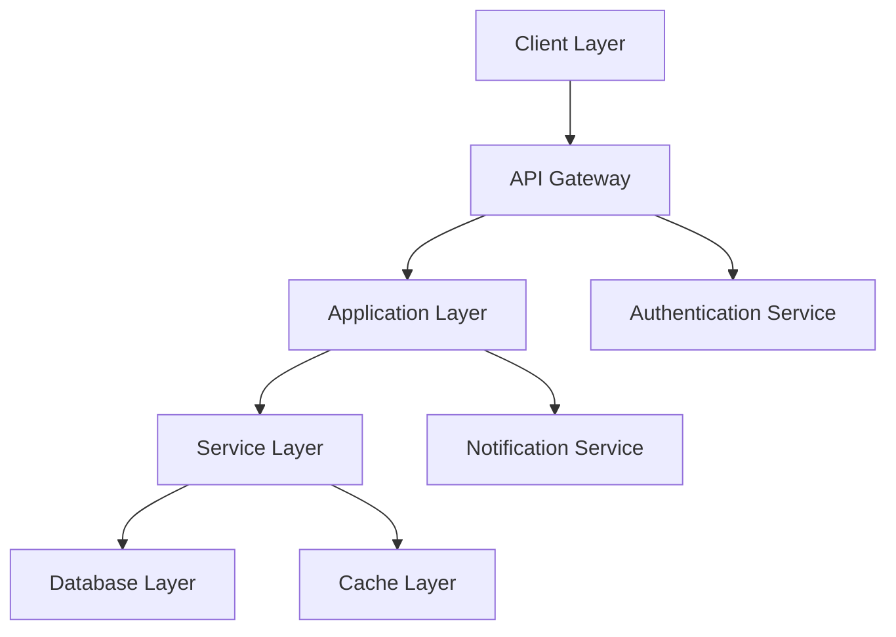

# 🚀 E-OD: Events and OD Management Platform

## 📋 Table of Contents
- [Overview](#overview)
- [Core Features](#core-features)
- [Architecture](#architecture)
- [Technical Stack](#technical-stack)
- [Getting Started](#getting-started)
- [Project Structure](#project-structure)
- [API Documentation](#api-documentation)
- [Security](#security)
- [User Roles & Permissions](#user-roles--permissions)
- [Contributing](#contributing)
- [Support](#support)

## Overview

The E-OD System is a modern, scalable platform designed to digitize and streamline On-Duty (OD) management and event organization in educational institutions. It replaces traditional paper-based workflows with an efficient digital solution that maintains institutional hierarchies while providing real-time updates and transparent tracking.

### Key Benefits
- Reduced processing time for OD approvals
- Paperless, environment-friendly workflow
- Real-time tracking and notifications
- Comprehensive event management
- Data-driven insights for administration
- Enhanced transparency and accountability

## Core Features

### Student Portal
- **Smart OD Request System**
  - Intuitive form with auto-fill capabilities
  - Document upload support (medical certificates, event invitations)
  - Multi-level approval tracking
  - Emergency request prioritization

- **Event Management**
  - One-click event registration
  - Participation certificate generation
  - Event calendar integration
  - Automated attendance marking

- **Dashboard Analytics**
  - OD usage statistics
  - Event participation history
  - Course-wise attendance reports
  - Notification center

### Faculty Dashboard
- **OD Management Console**
  - Batch approval capabilities
  - Custom approval workflows
  - Student history view
  - Communication channel with students

- **Course Management**
  - Attendance tracking and reports
  - Course schedule management
  - Student performance analytics
  - Bulk operations support

### Administrative Interface
- **System Configuration**
  - Role-based access control
  - Department and course setup
  - Academic calendar management
  - Policy configuration

- **Analytics & Reporting**
  - Institution-wide attendance insights
  - Event participation statistics
  - OD pattern analysis
  - Custom report generation

## Architecture

### System Design


### Security Architecture
- JWT-based authentication
- Role-based access control (RBAC)
- API rate limiting
- Request validation middleware
- Data encryption at rest
- Audit logging

## Technical Stack

### Frontend
- **Framework**: React.js 18
- **State Management**: Redux Toolkit
- **UI Components**: Material-UI v5
- **Form Handling**: React Hook Form
- **API Client**: Axios
- **Testing**: Jest & React Testing Library

### Backend
- **Runtime**: Node.js 18+
- **Framework**: Express.js
- **Database**: MongoDB
- **Caching**: Redis
- **Task Queue**: Bull
- **Testing**: Mocha & Chai

### DevOps
- **Containerization**: Docker
- **CI/CD**: GitHub Actions
- **Monitoring**: Prometheus & Grafana
- **Logging**: ELK Stack

## Getting Started

### Prerequisites
- Node.js 18+
- MongoDB 5+
- Redis (optional)
- Git

### Installation

1. Clone the repository:
```bash
git clone https://github.com/yourusername/e-od-system.git
cd e-od-system
```

2. Set up environment variables:
```bash
# Backend (.env)
PORT=5000
MONGODB_URI=mongodb://localhost:27017/e-od
JWT_SECRET=your_secure_secret
NODE_ENV=development
REDIS_URL=redis://localhost:6379
SMTP_HOST=smtp.example.com
SMTP_PORT=587
SMTP_USER=your_email
SMTP_PASS=your_password

# Frontend (.env.local)
VITE_API_URL=http://localhost:5000/api
VITE_APP_ENV=development
```

3. Install dependencies:
```bash
# Backend
cd backend
npm install

# Frontend
cd frontend
npm install
```

4. Start development servers:
```bash
# Backend
npm run dev

# Frontend
npm run dev
```

### Docker Deployment
```bash
# Build images
docker-compose build

# Start services
docker-compose up -d
```

## Project Structure

```
E-OD-SYSTEM/
├── backend/
│   ├── config/
│   │   ├── database.js
│   │   ├── redis.js
│   │   └── mail.js
│   ├── controllers/
│   │   ├── auth.controller.js
│   │   ├── events.controller.js
│   │   └── od.controller.js
│   ├── middleware/
│   │   ├── auth.middleware.js
│   │   ├── validation.middleware.js
│   │   └── error.middleware.js
│   ├── models/
│   │   ├── user.model.js
│   │   ├── event.model.js
│   │   └── od.model.js
│   ├── routes/
│   │   ├── auth.routes.js
│   │   ├── events.routes.js
│   │   └── od.routes.js
│   ├── services/
│   │   ├── mail.service.js
│   │   └── notification.service.js
│   └── server.js
├── frontend/
│   ├── src/
│   │   ├── assets/
│   │   ├── components/
│   │   │   ├── common/
│   │   │   ├── forms/
│   │   │   └── layouts/
│   │   ├── hooks/
│   │   ├── pages/
│   │   ├── services/
│   │   ├── store/
│   │   ├── utils/
│   │   ├── App.jsx
│   │   └── main.jsx
│   └── package.json
├── docker-compose.yml
└── README.md
```

## API Documentation

### Authentication
```
POST /api/auth/register
POST /api/auth/login
POST /api/auth/refresh-token
POST /api/auth/logout
```

### Events
```
GET    /api/events
POST   /api/events
GET    /api/events/:id
PUT    /api/events/:id
DELETE /api/events/:id
POST   /api/events/:id/register
```

### OD Management
```
POST   /api/od
GET    /api/od
GET    /api/od/:id
PUT    /api/od/:id
DELETE /api/od/:id
POST   /api/od/:id/approve
POST   /api/od/:id/reject
```

### User Management
```
GET    /api/users
GET    /api/users/:id
PUT    /api/users/:id
DELETE /api/users/:id
GET    /api/users/:id/courses
POST   /api/users/:id/courses
```

## Security

### Authentication Flow
1. User login with credentials
2. JWT token generation with expiry
3. Refresh token rotation
4. Secure cookie storage
5. CSRF protection

### Data Protection
- Input sanitization
- XSS prevention
- SQL injection protection
- Rate limiting
- Request validation

## User Roles & Permissions

### Role Hierarchy
1. **Super Admin**
   - Full system access
   - User management
   - System configuration

2. **Department HOD**
   - Department-wide access
   - Final OD approval
   - Staff management

3. **Academic Coordinator**
   - Course coordination
   - Second-level OD approval
   - Event approval

4. **Faculty**
   - Course management
   - First-level OD approval
   - Attendance management

5. **Event Organizer**
   - Event creation
   - Participant management
   - Certificate generation

6. **Student**
   - OD requests
   - Event registration
   - Profile management

### Permission Matrix
| Feature           | Student | Faculty | Coordinator | HOD | Admin |
|-------------------|---------|---------|-------------|-----|-------|
| View Events       | ✅      | ✅      | ✅          | ✅  | ✅    |
| Create Events     | ❌      | ✅      | ✅          | ✅  | ✅    |
| Request OD        | ✅      | ❌      | ❌          | ❌  | ❌    |
| Approve OD        | ❌      | ✅      | ✅          | ✅  | ✅    |
| Manage Users      | ❌      | ❌      | ❌          | ✅  | ✅    |
| System Config     | ❌      | ❌      | ❌          | ❌  | ✅    |

## Contributing

### Development Workflow
1. Fork the repository
2. Create feature branch
3. Commit changes
4. Create pull request
5. Code review
6. Merge

### Code Standards
- ESLint configuration
- Prettier formatting
- TypeScript strict mode
- Unit test coverage
- Documentation requirements

### Team
- Abishek ([@Abishek1006](https://github.com/Abishek1006)) - Frontend Lead
- Arjun ([@Arjun-Debugs](https://github.com/Arjun-Debugs)) - Backend Lead
- Dulal Roy ([@DulalRoy12022005](https://github.com/DulalRoy12022005)) - DevOps Lead
